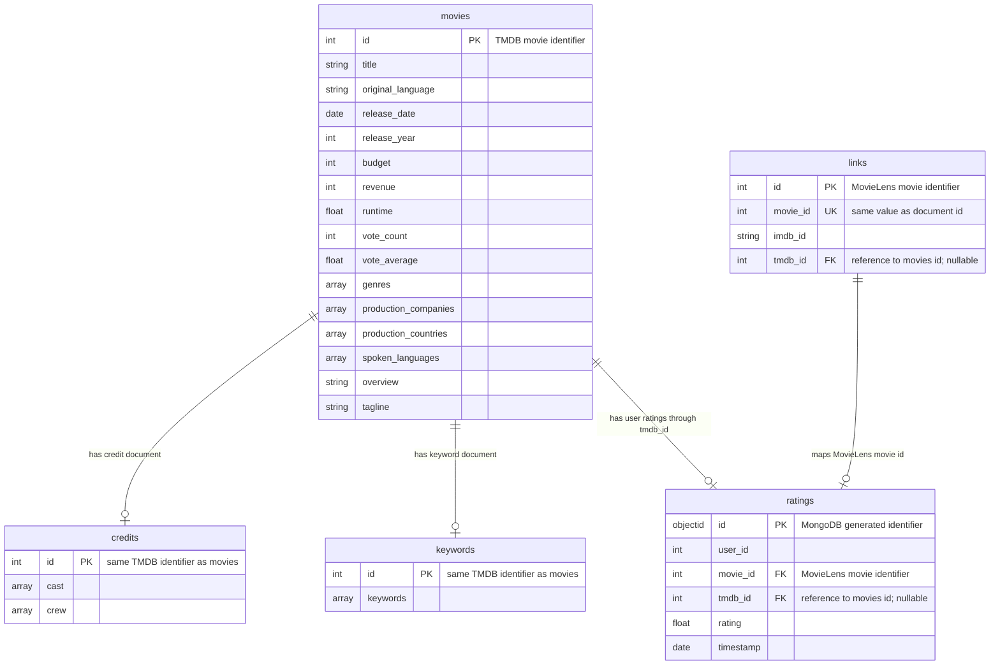

## Entity Model

```mermaid
erDiagram
    movies ||--o| credits : "has credit document"
    movies ||--o| keywords : "has keyword document"
    movies ||--o| ratings : "has user ratings through tmdb_id"
    links ||--o| ratings : "maps MovieLens movie id"
    movies {
        int id PK "TMDB movie identifier"
        string title
        string original_language
        date release_date
        int release_year
        int budget
        int revenue
        float runtime
        int vote_count
        float vote_average
        array genres
        array production_companies
        array production_countries
        array spoken_languages
        string overview
        string tagline
    }
    credits {
        int id PK "same TMDB identifier as movies"
        array cast
        array crew
    }
    keywords {
        int id PK "same TMDB identifier as movies"
        array keywords
    }
    ratings {
        objectid id PK "MongoDB generated identifier"
        int user_id
        int movie_id FK "MovieLens movie identifier"
        int tmdb_id FK "reference to movies id; nullable"
        float rating
        date timestamp
    }
    links {
        int id PK "MovieLens movie identifier"
        int movie_id UK "same value as document id"
        string imdb_id
        int tmdb_id FK "reference to movies id; nullable"
    }
```
