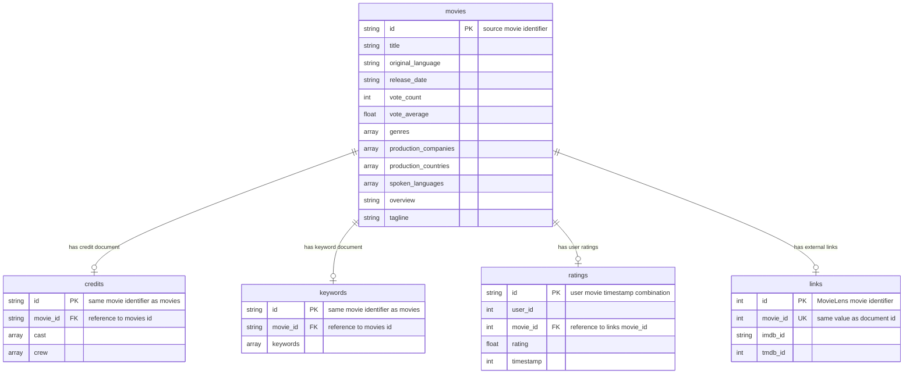

## Entity Model

```mermaid
erDiagram
    movies ||--o| credits : "has credit document"
    movies ||--o| keywords : "has keyword document"
    movies ||--o| ratings : "has user ratings"
    movies ||--o| links : "has external links"
    movies {
        string id PK "source movie identifier"
        string title
        string original_language
        string release_date
        int vote_count
        float vote_average
        array genres
        array production_companies
        array production_countries
        array spoken_languages
        string overview
        string tagline
    }
    credits {
        string id PK "same movie identifier as movies"
        string movie_id FK "reference to movies id"
        array cast
        array crew
    }
    keywords {
        string id PK "same movie identifier as movies"
        string movie_id FK "reference to movies id"
        array keywords
    }
    ratings {
        string id PK "user movie timestamp combination"
        int user_id
        int movie_id FK "reference to links movie_id"
        float rating
        int timestamp
    }
    links {
        int id PK "MovieLens movie identifier"
        int movie_id UK "same value as document id"
        string imdb_id
        int tmdb_id
    }
```
